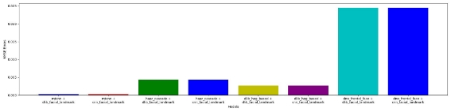
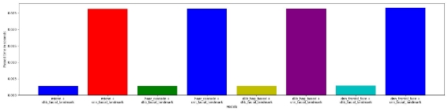
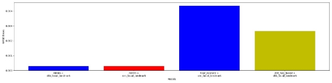
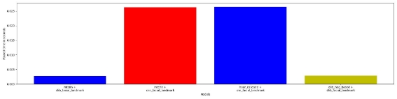
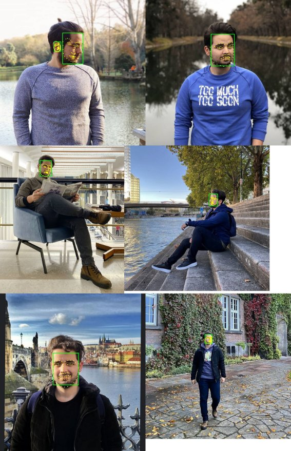

# Facial_Recognation
Usage: 
 python detect_faces.py --images <image_folder_path> --save_res True --save_facial_landmarks True
## 1  INTRODUCTION

Since the 1990s, face alignment between images has been an active subject of study. In many applications, such as 3D face reconstruction and face recognition, face alignment plays an important role, since it is mostly used as a pre-processing stage. Face alignment has recently made considerable success in both theory and practice. While AAM-based approaches and regression-based approaches work well with small poses for face images, they are typically unable to handle profile face images as they do not consider landmark visibility.

## 2  METHOD AND MODELS

In this study, we first determined the face in order to extract the features of the face well. Then we extract 68 facial alignment points on the detected face. There are many models both of detection and alignment. So the question selecting best model for them.

### 2.0.1 MTCNN

MTCNN or Multi-Task Cascaded Convolutional Neural Networks is a neural network which detects faces and facial landmarks on images. It was published in 2016 by Zhang et al.[ZZLQ16]

### 2.0.2 DNN Frontal Face

After OpenCv 3.3 release, Opencv made available to Face detection with DNN frontal face. The model trained in Caffe environment which is a deep learning framework made with expression, speed, and modu- larity in mind. Model can be loaded by Opencv library.[dnn]

### 2.0.3 Haar Cascade Detector

Object Detection using Haar feature-based cascade classifiers is an ef- fective object detection method proposed by Paul Viola and Michael Jones in their paper, “Rapid Object Detection using a Boosted Cascade of Simple Features” in 2001. It is a machine learning based approach where a cascade function is trained from a lot of positive and negative images. It is then used to detect objects in other images.[haa]

### 2.0.4 Dlib HOG Based Detector

Dlib HOG Based Detector is based on the HOG (Histogram of Oriented Gradients) feature descriptor with a linear SVM machine learning algo- rithm to perform face detection. HOG is a simple and powerful feature descriptor. It is not only used for face detection but also it is widely used for object detection like cars, pets, and fruits. Model can be loaded by Dlib library.[dlia]

## 2.1 Face Alignment Models

#### 1. CNN Facial Landmark Extractor

CNN Facial Landmark Extractor is a Tensorflow based model that ex- tract 68 points from detected faces.[cnn]

#### 2. Dlib Facial Landmark Extractor

The facial landmark detector included in the dlib library is an imple- mentation of the One Millisecond Face Alignment with an Ensemble of Regression Trees paper by Kazemi and Sullivan (2014).[dlib]

4  EXPERIMENTS

To test the success rates of the models, we try all combinations of the face detection models and face alignments. And we evaluate the results according to error and time. You can find these graph in Figure 1 and Figure 2.

For evaluating a result, we have search popular methods for facial land- mark evaluation. We have selected MSE (mean squared error). But our images have different sizes. So distance between faces can be big in high- resolution image and similarly can be small in low-resolution image.We have to normalize image and to fix it We divided error by with times height of image.

We investigate models in 2 manner : error rate and time rate. Because models have to be good enough to extract landmarks and this process not be so long. But error rate important than time for us.

The figure 3 and figure 4 show the results of the models in all combina- tions. It is difficultto compare the best 4 models from here. For this reason, We took 4 best model for more detailed comparison and zoomed results are shown in figures 5 and figure 6.

Figure 3: Error Graph

Figure 4: Time Graph

Figure 5: Zoom Error Graph

Figure 6: Zoom Time Graph

5 RESULTS

As can be seen from 3 , there are relatively 2 more successfull models than others which are model 1( mtccn + dlib facial landmark) and model 2 (mtcnn + cnn facial landmark). So logical idea is compare this 2 models in time man- ner, and then we can select model 1 as a best models for Facial recognition from images.

The best models results are given in the last page.

References

[cnn] [https://github.com/yinguobing/cnn-facial-landmark . ](https://github.com/yinguobing/cnn-facial-landmark)[dlia] [https://towardsdatascience.com/](https://towardsdatascience.com/cnn-based-face-detector-from-dlib-c3696195e01c)

[cnn-based-face-detector-from-dlib-c3696195e01c .](https://towardsdatascience.com/cnn-based-face-detector-from-dlib-c3696195e01c)

[dlib] [https://www.pyimagesearch.com/2017/05/22/](https://www.pyimagesearch.com/2017/05/22/face-alignment-with-opencv-and-python/)

[face-alignment-with-opencv-and-python/ .](https://www.pyimagesearch.com/2017/05/22/face-alignment-with-opencv-and-python/)

[dnn] [https://www.pyimagesearch.com/2018/02/26/](https://www.pyimagesearch.com/2018/02/26/face-detection-with-opencv-and-deep-learning/)

[face-detection-with-opencv-and-deep-learning/ . ](https://www.pyimagesearch.com/2018/02/26/face-detection-with-opencv-and-deep-learning/)[haa] [https://opencv-python-tutroals.readthedocs.io/en/](https://opencv-python-tutroals.readthedocs.io/en/latest/py_tutorials/py_objdetect/py_face_detection/py_face_detection.html)

[latest/py_tutorials/py_objdetect/py_face_detection/py_](https://opencv-python-tutroals.readthedocs.io/en/latest/py_tutorials/py_objdetect/py_face_detection/py_face_detection.html)

[face_detection.html .](https://opencv-python-tutroals.readthedocs.io/en/latest/py_tutorials/py_objdetect/py_face_detection/py_face_detection.html)

[ZZLQ16] Kaipeng Zhang, Zhanpeng Zhang, Zhifeng Li, and Yu Qiao.

8
